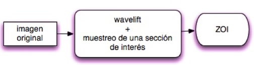
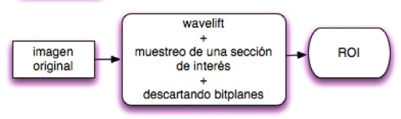
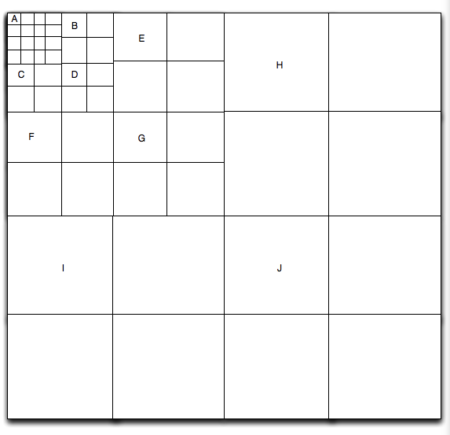
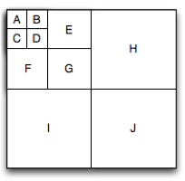

# ZOI-ROI
Práctica en Matlab sobre la zona de interés y región de interés

## Objetivo
*Realizar una función que le llamaremos ZOI.m donde solo se visualizara una sección de la imagen.

*Realizar una función que le llamaremos ROI.m donde usaremos la función bitplane.m y solo se mantendrá sin perdida o recuperada una sección de la imagen.

## Introducción
Los puntos de interés deben ser encontrados en diferentes puntos de la imagen resultante después de aplicar la wavelift, porque la búsqueda de correspondencias requiere la comparación de secciones de la imagen a diferentes niveles. Los espacios escala se aplican en general como una pirámide de imagen. Las imágenes se suavizan repetidamente con un filtro gaussiano y luego, se submostrea a fin de conseguir un nivel superior de la pirámide.

## Función ZOI

## Función ROI

## Procedimiento
Para la función ZOI la única variable que requiero es donde se guardo la imagen, para posteriormente aplicarle la función Component_Transformation para pasar la imagen a YCbCr, despues una wavelift a nivel 3 y tomar secciones de la resultante para posteriormente en una nueva matriz que tendrá el tamaño de la mitad de la imagen original pasarle esas secciones como se muestra en la imagen 1, luego a continuación una vez juntadas en la nueva matriz le aplico la wavelift -3 para regresarla a continuación con la función Component_Transformation la regreso a RGB y así obtengo solo una sección de la imagen original como la imagen 2 ya por ultimo determino sus Y, Cb y Cr máximos.

Procedimiento para pasar la matriz 
A a la matriz B.

	
	
	

